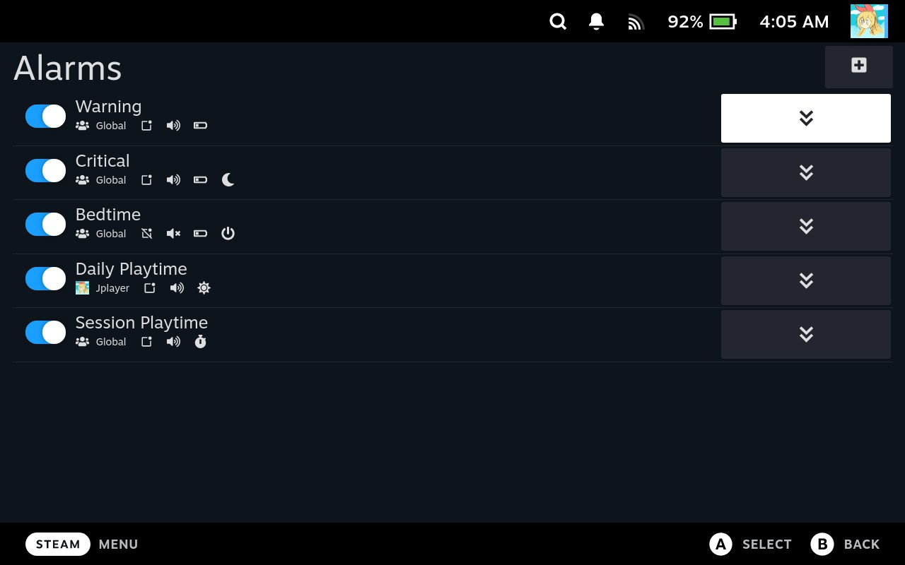

].versions[0].name&url=https%3A%2F%2Fplugins.deckbrew.xyz%2Fplugins) 
## Decky-AutoSuspend Plugin
A plugin to notify and automatically suspend your steamdeck console when passing battery percentage thresholds.

## Overview
This plugin provides audible and toast notifications when reaching an overcharge and warning battery levels. It will also send a notification and autosuspend the device at critical battery levels. Thresholds can be enabled/disabled independently and the notifications can be toggled off if completely silent autosuspend is preferred.

## Installation
#### Decky-Loader Store
1. [Install decky-loader](https://github.com/SteamDeckHomebrew/decky-loader#installation)
2. Use the built in plugin store to download the AutoSuspend plugin
#### Manual Installation
For manual installation, steps 8-13 are optional, but will require a terminal and a keyboard preferably (not required), and just changes the AutoSuspend folder's owner to `deck`. Please follow them in order, from top to bottom.

1. Start the deck in Gaming Mode
2. Open Decky-Loader in the QAM
3. Go to Decky settings
4. Scroll down the General settings using the D-Pad/Joystick, not touch
5. On `Manual plugin install` section, keep navigating using the D-Pad/Joystick until the `URL` entry is highlighted
6. Press A to bring up the virtual keyboard, or use your own keyboard to add the following url:
   - `https://github.com/jurassicplayer/decky-autosuspend/releases/latest/download/decky-autosuspend.zip`
7. Press `Install` and `Confirm`
8. Go to desktop mode (`Steam` menu => `Power` => `Switch to Desktop`)
9. Open the start menu
10. Search and open the application called `Konsole`
11. Type in the following command
  - `sudo chown -R deck:deck ~/homebrew/plugins/decky-autosuspend`
12. Press Enter to run the command (it will prompt for your password, which is the same one you used when you installed decky-loader)
13. Return to Gaming Mode and enjoy \o/

## Usage
- Press the hamburger menu button to toggle visibility of disabled thresholds
- Adjust the warning and critical threshold sliders to the desired percentage using either the slider or the entry box
- Apply threshold settings with the `Apply Changes` button
- Adjust notifications to your preference: Toast & Sound, Toast Only, Sound Only, or No notifications

## Functionality
- Notifications are only sent AFTER passing the threshold value and do not get sent again until charging above the threshold
   - Ex. With a threshold value of 40%
      - A notification will be sent at 40% and threshold won't send another until reset
      - The notification will be reset after charging up to at least 41%
- The `Apply Settings` button is specifically for the warning/critical/overcharge sliders, notification settings are applied instantly.
- The warning threshold slider will be disabled when lower than the critical threshold.
- The overcharge threshold slider will be disabled when lower than either warning or critical thresholds.

## Ran Into an Issue?
- In order to properly assess what could potentially be happening, you must be able to reproduce the issue or provide steps for me to attempt reproducing the issue. In the event that you are able to repeatedly reproduce the issue, please follow the following steps and submit the logs so I can fix it for you :D (that's the hope anyways).
#### Obtaining debugging information
- Reset your device
- Ensure that your device and a computer are connected on the same network
- Go to the Decky settings and enable `Allow Remote CEF Debugging`
- From the computer, navigate to `http://<steamdeck-ip>:8081` using a google chrome/chromium-based browser
- On the list of links, click `Steam`
- Click on the `Console` tab
- Set the `Log Level` dropdown (to the right of the `Filter` box) to include `Verbose`
- Reproduce the issue on your device
- Right click on the log and choose `Save as...` OR make screenshots beginning from the line: `Trying to load AutoSuspend`
- Upload the file/screenshots to a new/relevant [Github issue](https://github.com/jurassicplayer/decky-autosuspend/issues)

## Notes
- The plugin is basically feature complete until someone broadens my horizons.
- This plugin is integrated with SteamOS and utilizes Valve's functions to suspend/play notifications sounds
   - The notification sound effect will follow any applied sound packs from [SDH-AudioLoader](https://github.com/EMERALD0874/SDH-AudioLoader)
   - Suspending shouldn't cause any issues unforseen issues that aren't already present when using SteamOS's suspend.
- I basically don't know ReactJS, so if there is a glaring flaw feel free to create an issue, PR, or w/e.

## Future Plans
- Maybe look into finding SteamOS's battery warning toasts
   - See if I can change their internal levels from the default 10%, 5%, 3%
   - Inhibit/Re-use SteamOS's battery warning toasts
- Bugfixes

## Thanks
- [@AAGaming00](https://github.com/AAGaming00)
- [@Beebles](https://github.com/beebls)
- [@EMERALD0874](https://github.com/EMERALD0874)
- All the other plugin devs (without their plugins as examples, I wouldn't have known what I was doing)
